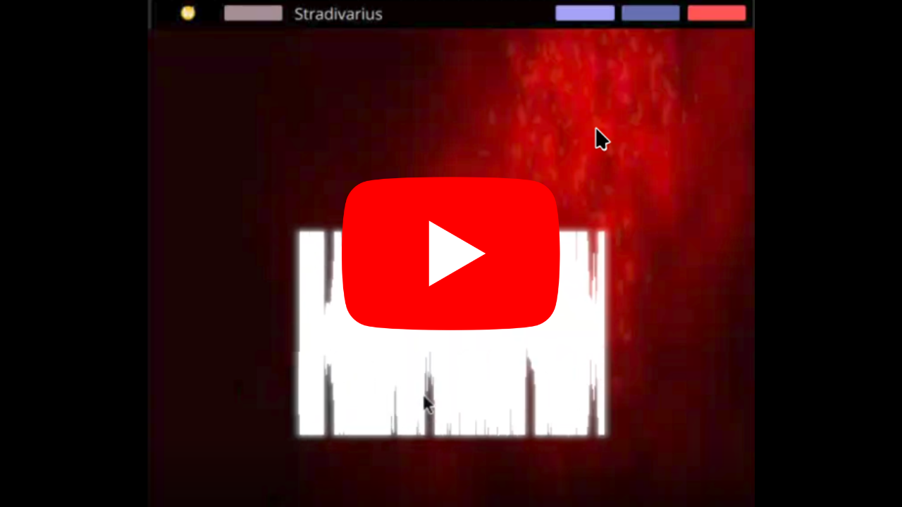

## Stradivarius

### Demo:
[](https://youtu.be/PHnlwu1hiY8)

Run Strad with:
```
make build
./target/app ./path/to/wav_file
```

Controls:

`1`, `2`, `3` : numbers toggle between visualizers.

`b` : Enables bloom effect

`n` : Disable bloom effect

`Arrow Keys` : Rotates waveform 3